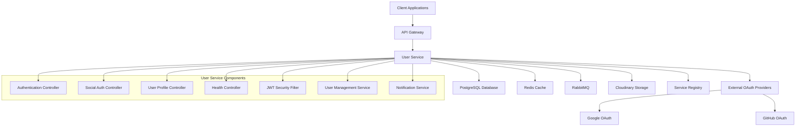
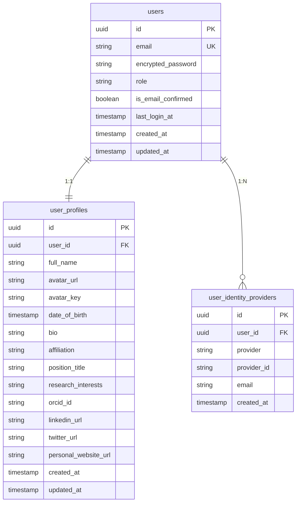

# 👤 ScholarAI User Service

## 🌟 Overview

The **User Service** is a comprehensive authentication and user management microservice for the ScholarAI platform. It provides secure user registration, authentication, profile management, and social login capabilities with enterprise-grade security features.

## 📋 Table of Contents

- [Features](#-features)
- [Technology Stack](#-technology-stack)
- [Architecture](#-architecture)
- [Getting Started](#-getting-started)
- [API Documentation](#-api-documentation)
- [Configuration](#-configuration)
- [Database Schema](#-database-schema)
- [Security](#-security)
- [Social Authentication](#-social-authentication)
- [Testing](#-testing)
- [Deployment](#-deployment)
- [Monitoring](#-monitoring)
- [Contributing](#-contributing)

## ✨ Features

### 🔐 Authentication & Authorization
- **JWT-based Authentication** with access and refresh tokens
- **Secure Password Hashing** using BCrypt
- **Email Verification** with OTP codes
- **Password Reset** functionality
- **Token Refresh** mechanism
- **Role-based Access Control** (USER, ADMIN, PROFESSOR, STUDENT)

### 🌐 Social Authentication
- **Google OAuth 2.0** integration
- **GitHub OAuth** integration
- **Unified User Identity** across authentication methods
- **Provider Account Linking**

### 👥 User Profile Management
- **Comprehensive User Profiles** with academic information
- **Avatar Upload & Management** with Cloudinary integration
- **Academic Profile Fields** (affiliation, research interests, ORCID)
- **Social Media Links** (LinkedIn, Twitter, personal website)
- **Profile Picture Management**

### 🔧 Advanced Features
- **Redis Caching** for performance optimization
- **RabbitMQ Integration** for asynchronous notifications
- **Database Migrations** with Flyway
- **Health Monitoring** with Spring Actuator
- **API Documentation** with OpenAPI 3.0 (Swagger)
- **Service Discovery** with Eureka Client

## 🛠 Technology Stack

### Core Framework
- **Spring Boot 3.5.0** - Main application framework
- **Java 21** - Programming language
- **Maven** - Build management tool

### Security & Authentication
- **Spring Security** - Security framework
- **JWT (JJWT 0.12.6)** - Token-based authentication
- **BCrypt** - Password hashing
- **Google OAuth Client** - Social authentication

### Database & Storage
- **PostgreSQL** - Primary database
- **Redis** - Caching and session storage
- **Flyway 11.10.2** - Database migrations
- **Spring Data JPA** - Data access layer
- **Cloudinary** - Image storage for avatars

### Messaging & Communication
- **RabbitMQ** - Message broker for notifications
- **Spring AMQP** - RabbitMQ integration

### Monitoring & Documentation
- **Spring Actuator** - Health monitoring
- **SpringDoc OpenAPI 2.8.9** - API documentation
- **Eureka Client** - Service discovery

### Development Tools
- **Lombok** - Boilerplate code reduction
- **MapStruct 1.6.3** - Object mapping
- **Spotless** - Code formatting
- **Spring DevTools** - Development utilities

## 🏗 Architecture



### Database Schema



## 🚀 Getting Started

### Prerequisites

- **Java 21** or higher
- **Maven 3.8+**
- **PostgreSQL 13+**
- **Redis 6+**
- **RabbitMQ 3.8+**
- **Docker & Docker Compose** (for containerized setup)

### Local Development Setup

#### 1. Clone and Navigate
```bash
git clone <repository-url>
cd user-service
```

#### 2. Environment Configuration
Create `.env` file:
```env
# Database Configuration
USER_DB_USER=your_db_user
USER_DB_PASSWORD=your_db_password

# JWT Configuration
JWT_SECRET=your_super_secret_jwt_key_here
JWT_ACCESS_EXPIRATION_MS=600000
JWT_REFRESH_EXPIRATION_MS=604800000

# Redis Configuration
REDIS_HOST=localhost
REDIS_PORT=6379
REDIS_PASSWORD=your_redis_password

# OAuth Configuration
GOOGLE_CLIENT_ID=your_google_client_id
GOOGLE_CLIENT_SECRET=your_google_client_secret
GITHUB_CLIENT_ID=your_github_client_id
GITHUB_CLIENT_SECRET=your_github_client_secret

# Cloudinary Configuration
CLOUDINARY_CLOUD_NAME=your_cloud_name
CLOUDINARY_API_KEY=your_api_key
CLOUDINARY_API_SECRET=your_api_secret

# RabbitMQ Configuration
RABBITMQ_HOST=localhost
RABBITMQ_PORT=5672
RABBITMQ_USERNAME=guest
RABBITMQ_PASSWORD=guest
```

#### 3. Database Setup
```bash
# Start PostgreSQL and create database
createdb userDB

# Start Redis
redis-server

# Start RabbitMQ
rabbitmq-server
```

#### 4. Build and Run
```bash
# Build the application
./mvnw clean install

# Run with local profile
./mvnw spring-boot:run -Dspring.profiles.active=local
```

### Docker Setup

#### Using Docker Compose
```bash
# Start all services
docker-compose up -d

# View logs
docker-compose logs -f user-service

# Stop services
docker-compose down
```

#### Build Docker Image
```bash
# Build image
docker build -t scholarai/user-service:latest .

# Run container
docker run -p 8081:8081 \
  --env-file .env \
  scholarai/user-service:latest
```

## 📖 API Documentation

### Interactive Documentation
- **Swagger UI**: `http://localhost:8081/swagger-ui.html`
- **OpenAPI JSON**: `http://localhost:8081/v3/api-docs`

### Authentication Endpoints

#### User Registration
```http
POST /api/v1/auth/register
Content-Type: application/json

{
  "email": "user@example.com",
  "password": "securePassword123",
  "role": "USER"
}
```

#### User Login
```http
POST /api/v1/auth/login
Content-Type: application/json

{
  "email": "user@example.com",
  "password": "securePassword123"
}
```

#### Token Refresh
```http
POST /api/v1/auth/refresh
Content-Type: application/json

{
  "refreshToken": "your_refresh_token"
}
```

#### Email Confirmation
```http
POST /api/v1/auth/confirm-email
Content-Type: application/json

{
  "email": "user@example.com",
  "otp": "123456"
}
```

#### Password Reset
```http
POST /api/v1/auth/forgot-password?email=user@example.com

POST /api/v1/auth/reset-password
?email=user@example.com
&code=123456
&newPassword=newSecurePassword123
```

### Social Authentication Endpoints

#### Google OAuth Login
```http
POST /api/v1/auth/social/google-login
Content-Type: application/json

{
  "idToken": "google_id_token_here"
}
```

#### GitHub OAuth Login
```http
POST /api/v1/auth/social/github-login
Content-Type: application/json

{
  "code": "github_authorization_code"
}
```

### User Profile Endpoints

#### Get Profile
```http
GET /api/v1/profile
Authorization: Bearer your_access_token
```

#### Update Profile
```http
PATCH /api/v1/profile
Authorization: Bearer your_access_token
Content-Type: application/json

{
  "fullName": "John Doe",
  "bio": "Software Engineer passionate about AI",
  "affiliation": "Tech University",
  "researchInterests": "AI, Machine Learning, Deep Learning",
  "dateOfBirth": "1990-01-01T00:00:00Z"
}
```

#### Upload Avatar
```http
POST /api/v1/profile/avatar
Authorization: Bearer your_access_token
Content-Type: multipart/form-data

avatar: [image file]
```

#### Delete Avatar
```http
DELETE /api/v1/profile/avatar
Authorization: Bearer your_access_token
```

### Utility Endpoints

#### Check Email Availability
```http
GET /api/v1/auth/check-email-availability?email=user@example.com
```

#### Check Email Status
```http
GET /api/v1/auth/check-email-status?email=user@example.com
```

#### Health Check
```http
GET /actuator/health
```

## ⚙️ Configuration

### Application Profiles

#### Local Development (`application-local.yml`)
```yaml
spring:
  datasource:
    url: jdbc:postgresql://localhost:5432/userDB
  flyway:
    enabled: true
  jpa:
    hibernate:
      ddl-auto: validate
    show-sql: true
```

#### Docker Environment (`application-docker.yml`)
```yaml
spring:
  datasource:
    url: jdbc:postgresql://user-db:5432/userDB
  data:
    redis:
      host: user-redis
      port: 6379
```

#### Production (`application-prod.yml`)
```yaml
spring:
  jpa:
    hibernate:
      ddl-auto: validate
    show-sql: false
  flyway:
    enabled: true
    validate-on-migrate: true
```

### Security Configuration

#### JWT Settings
```yaml
spring:
  app:
    jwtSecret: ${JWT_SECRET}
    access:
      expiration-ms: ${JWT_ACCESS_EXPIRATION_MS:600000}  # 10 minutes
    refresh:
      expiration-ms: ${JWT_REFRESH_EXPIRATION_MS:604800000}  # 7 days
```

#### OAuth Configuration
```yaml
oauth:
  google:
    client-id: ${GOOGLE_CLIENT_ID}
    client-secret: ${GOOGLE_CLIENT_SECRET}
  github:
    client-id: ${GITHUB_CLIENT_ID}
    client-secret: ${GITHUB_CLIENT_SECRET}
```

## 🗄️ Database Schema

The service uses **Flyway** for database migrations with the following schema:

### Migration Files
1. **V1__Create_users_table.sql** - Core user accounts
2. **V2__Create_user_profiles_table.sql** - Extended profile information
3. **V3__Create_user_identity_providers_table.sql** - Social authentication providers
4. **V4__Update_user_role_to_enum.sql** - Role enumeration
5. **V5__Add_avatar_fields_to_user_profiles.sql** - Avatar management

### Key Tables

#### Users Table
- **Primary authentication table**
- Stores email, encrypted password, role
- Email confirmation status
- Audit fields (created_at, updated_at, last_login_at)

#### User Profiles Table
- **Extended user information**
- Academic profile fields
- Social media links
- Avatar management
- Research interests and affiliations

#### User Identity Providers Table
- **Social authentication mapping**
- Links users to OAuth providers
- Supports multiple providers per user

### Database Indexes
```sql
-- Performance optimization indexes
CREATE INDEX idx_users_email ON users(email);
CREATE INDEX idx_users_role ON users(role);
CREATE INDEX idx_user_profiles_user_id ON user_profiles(user_id);
CREATE INDEX idx_user_identity_providers_user_email ON user_identity_providers(user_email);
```

## 🔒 Security

### Authentication Flow
1. **User Registration** with email verification
2. **Login** returns JWT access token + HttpOnly refresh token cookie
3. **Access Token** for API authentication (10 minutes)
4. **Refresh Token** for token renewal (7 days)
5. **Token Rotation** on refresh for enhanced security

### Security Features
- **Password Hashing** with BCrypt (strength 12)
- **JWT Validation** with HMAC-SHA256
- **CORS Configuration** for cross-origin requests
- **Rate Limiting** on authentication endpoints
- **Secure Cookies** for refresh tokens
- **Input Validation** with Bean Validation
- **SQL Injection Protection** with JPA/Hibernate

### Security Headers
```yaml
security:
  headers:
    frame-options: DENY
    content-type-options: nosniff
    xss-protection: "1; mode=block"
    hsts: max-age=31536000; includeSubDomains
```

## 🌐 Social Authentication

### Supported Providers
- **Google OAuth 2.0** - ID token validation
- **GitHub OAuth** - Authorization code flow

### Integration Process

#### Google OAuth
1. Frontend obtains Google ID token
2. Backend validates token with Google
3. Extracts user information (email, name)
4. Creates or links user account
5. Returns ScholarAI JWT tokens

#### GitHub OAuth
1. Frontend gets authorization code from GitHub
2. Backend exchanges code for access token
3. Fetches user profile from GitHub API
4. Creates or links user account
5. Returns ScholarAI JWT tokens

### Account Linking
- **Automatic Linking** when email matches existing account
- **Provider Tracking** in user_identity_providers table
- **Multiple Providers** supported per user
- **Email Uniqueness** enforced across all auth methods

## 🧪 Testing

### Unit Tests
```bash
# Run all tests
./mvnw test

# Run specific test class
./mvnw test -Dtest=UserServiceApplicationTests

# Run with coverage
./mvnw test jacoco:report
```

### Integration Tests
```bash
# Test with H2 in-memory database
./mvnw test -Dspring.profiles.active=test

# Test Flyway migrations
./mvnw test -Dtest=FlywayMigrationTest
```

### API Testing with Swagger
1. Start the application
2. Navigate to `http://localhost:8081/swagger-ui.html`
3. Use the "Try it out" feature to test endpoints
4. Authenticate using the "Authorize" button with JWT tokens

### Test Configuration
```yaml
# application-test.yml
spring:
  datasource:
    url: jdbc:h2:mem:testdb
  jpa:
    hibernate:
      ddl-auto: create-drop
  flyway:
    enabled: false
```

## 🚀 Deployment

### Production Deployment

#### Environment Variables
```bash
# Production environment file
JWT_SECRET=your_production_jwt_secret
USER_DB_HOST=prod-db-host
USER_DB_USER=prod_user
USER_DB_PASSWORD=secure_password
REDIS_HOST=prod-redis-host
RABBITMQ_HOST=prod-rabbitmq-host
```

#### Kubernetes Deployment
```yaml
apiVersion: apps/v1
kind: Deployment
metadata:
  name: user-service
spec:
  replicas: 3
  selector:
    matchLabels:
      app: user-service
  template:
    metadata:
      labels:
        app: user-service
    spec:
      containers:
      - name: user-service
        image: scholarai/user-service:latest
        ports:
        - containerPort: 8081
        env:
        - name: SPRING_PROFILES_ACTIVE
          value: "prod"
        envFrom:
        - secretRef:
            name: user-service-secrets
```

#### Health Checks
```yaml
# Kubernetes health checks
livenessProbe:
  httpGet:
    path: /actuator/health
    port: 8081
  initialDelaySeconds: 30
  periodSeconds: 10

readinessProbe:
  httpGet:
    path: /actuator/health/readiness
    port: 8081
  initialDelaySeconds: 15
  periodSeconds: 5
```

### Docker Deployment
```dockerfile
FROM openjdk:21-jre-slim

COPY target/user_service-*.jar app.jar

EXPOSE 8081

ENTRYPOINT ["java", "-jar", "/app.jar"]
```

## 📊 Monitoring

### Health Endpoints
```bash
# Application health
curl http://localhost:8081/actuator/health

# Detailed health with components
curl http://localhost:8081/actuator/health/database
curl http://localhost:8081/actuator/health/redis
curl http://localhost:8081/actuator/health/rabbit
```

### Metrics Endpoints
```bash
# Application metrics
curl http://localhost:8081/actuator/metrics

# JVM metrics
curl http://localhost:8081/actuator/metrics/jvm.memory.used

# Database connection pool
curl http://localhost:8081/actuator/metrics/hikaricp.connections.active
```

### Logging Configuration
```yaml
logging:
  level:
    org.solace.scholar_ai.user_service: INFO
    org.springframework.security: DEBUG
    org.hibernate.SQL: DEBUG
  pattern:
    console: "%d{yyyy-MM-dd HH:mm:ss} - %msg%n"
    file: "%d{yyyy-MM-dd HH:mm:ss} [%thread] %-5level %logger{36} - %msg%n"
```

## 📝 API Response Format

All API responses follow a consistent format:

### Success Response
```json
{
  "statusCode": 200,
  "message": "Operation successful",
  "success": true,
  "data": {
    // Response data here
  }
}
```

### Error Response
```json
{
  "statusCode": 400,
  "message": "Error description",
  "success": false,
  "data": null
}
```

## 🔧 Troubleshooting

### Common Issues

#### Database Connection Errors
```bash
# Check database connectivity
pg_isready -h localhost -p 5432

# Verify credentials
psql -h localhost -U your_user -d userDB

# Check Flyway migration status
./mvnw flyway:info
```

#### Redis Connection Issues
```bash
# Test Redis connectivity
redis-cli ping

# Check Redis logs
redis-cli monitor
```

#### JWT Token Issues
- Verify JWT secret configuration
- Check token expiration times
- Validate token format and signature

#### OAuth Configuration
- Verify client IDs and secrets
- Check redirect URIs configuration
- Validate OAuth scope permissions

### Debug Mode
```bash
# Run with debug logging
./mvnw spring-boot:run -Dspring.profiles.active=local -Dlogging.level.org.solace.scholar_ai.user_service=DEBUG
```

## 🤝 Contributing

### Development Guidelines

1. **Code Style**: Follow Google Java Style Guide
2. **Testing**: Maintain minimum 80% code coverage
3. **Documentation**: Update API documentation for new endpoints
4. **Security**: Security review required for authentication changes
5. **Database**: Always use Flyway for schema changes

### Pull Request Process

1. **Fork** the repository
2. **Create** feature branch (`git checkout -b feature/amazing-feature`)
3. **Commit** changes (`git commit -m 'Add amazing feature'`)
4. **Push** to branch (`git push origin feature/amazing-feature`)
5. **Open** Pull Request with detailed description

### Code Quality Tools
```bash
# Format code
./mvnw spotless:apply

# Run quality checks
./mvnw checkstyle:check

# Security scan
./mvnw org.owasp:dependency-check-maven:check
```

## 📞 Support

### Contact Information
- **Team**: ScholarAI Development Team
- **Email**: support@scholarai.dev
- **Documentation**: [API Documentation](http://localhost:8081/swagger-ui.html)

### Resources
- **Spring Boot Documentation**: https://spring.io/projects/spring-boot
- **Spring Security**: https://spring.io/projects/spring-security
- **JWT**: https://jwt.io/
- **PostgreSQL**: https://www.postgresql.org/docs/
- **Redis**: https://redis.io/documentation

---

## 📄 License

This project is part of the ScholarAI platform. All rights reserved.

---

*Built with ❤️ by the ScholarAI Team* 